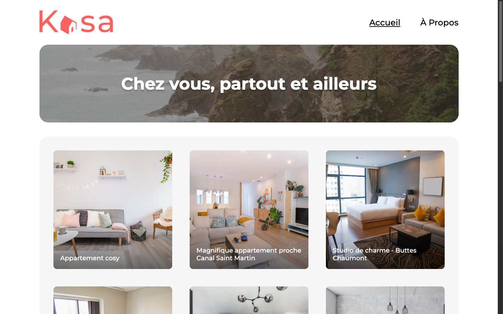
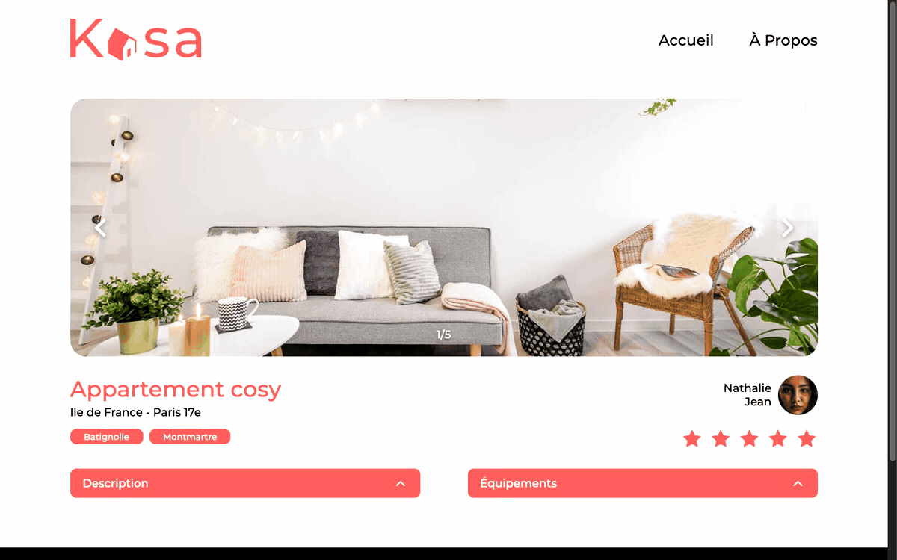
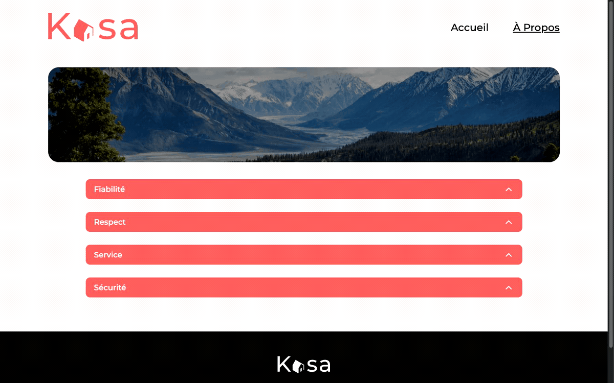

# Kasa

Application web de location de logements entre particuliers, développée en React avec un back-end Express.

Projet réalisé dans le cadre de la formation Testeur Logiciel (OpenClassrooms) [Coding guidelines Kasa](https://course.oc-static.com/projects/Front-End+V2/P9+React+1/Coding+guidelines+Kasa+FR.pdf).

## Contexte

Kasa est une plateforme fictive de location d'appartements. L'objectif est d'implémenter le front-end en respectant les maquettes Figma et les contraintes techniques du brief, en consommant les données via l'API back-end fournie par OpenClassrooms.

**Maquettes :** [UI Design Kasa (Figma)](https://www.figma.com/file/bAnXDNqRKCRRP8mY2gcb5p/UI-Design-Kasa-FR?node-id=4%3A1)

## Aperçu

### Accueil

Grille des 20 logements avec bannière et navigation.



### Carrousel

Défilement des photos sur la fiche logement (flèches, compteur, boucle).



### Collapse

Ouverture et fermeture animée des sections (page À propos).



### Page 404

Route inconnue ou identifiant de logement invalide.


## Fonctionnalités

| Page | Route | Description |
|------|-------|-------------|
| Accueil | `/` | Bannière + grille des 20 logements |
| Fiche logement | `/logement/:id` | Carrousel, tags, note, hôte, collapses |
| À propos | `/about` | Bannière + 4 collapses (valeurs Kasa) |
| Erreur | `*` | Page 404 avec lien retour accueil |

### Carrousel

- Défilement en boucle (première ↔ dernière image)
- Flèches et compteur masqués s'il n'y a qu'une seule photo
- Hauteur fixe, images recadrées (`object-fit: cover`)
- Compteur visible sur desktop, masqué sur mobile

### Collapse

- Fermé par défaut à l'initialisation
- Ouverture / fermeture au clic avec animation CSS
- Chevron animé à la rotation

### Cards (accueil)

- Lien vers la fiche logement
- Overlay sombre au survol

## Composants et props

Les composants réutilisables reçoivent leurs données via des **props** passées par les pages parentes. Chaque composant déclare un paramètre `props` et y accède avec la notation `props.nom` :

```jsx
function Card(props) {
  return (
    <Link to={'/logement/' + props.id}>
      
      <h2>{props.title}</h2>
    </Link>
  )
}
```

Les pages chargent les données (API ou contenu statique) et transmettent les valeurs aux enfants :

```jsx
<Card id={property.id} title={property.title} cover={property.cover} />
```

| Composant | Props | Utilisé dans |
|-----------|-------|--------------|
| `Banner` | `image`, `title` | Accueil, À propos |
| `Card` | `id`, `title`, `cover` | Accueil |
| `Carrousel` | `pictures`, `title` | Fiche logement |
| `Collapse` | `title`, `children` | Fiche logement, À propos |
| `Host` | `name`, `picture` | Fiche logement |
| `Rating` | `rating` | Fiche logement |
| `Tag` | `label` | Fiche logement |
| `Logo` | `variant` (optionnel, `'white'` pour le footer) | Header, Footer |

Les composants `Header`, `Footer` et `Layout` n'ont pas de props : leur contenu est fixe. Les pages (`Home`, `About`, `FicheLogement`, `Error`) gèrent leur propre état avec `useState` et les appels API.

## Stack technique

| Technologie | Rôle |
|-------------|------|
| React 19 | Composants fonctionnels, props, state, events |
| React Router 6 | Navigation et paramètres d'URL |
| CSS | Styles et media queries |
| Vite | Build et serveur de développement |
| Vitest + Testing Library | Tests unitaires |
| Express 4 | API REST des logements |

> **Note :** le brief OC mentionne Create React App et Sass. Ici j'utilise Vite et du CSS classique. Pas de librairie React en dehors de React Router.

## Données

Les 20 logements sont servis par le back-end Express depuis `backend/data.json`. Le front-end les récupère via `fetch` :

| Endpoint | Description |
|----------|-------------|
| `GET /api/properties` | Liste des 20 logements |
| `GET /api/properties/:id` | Détail d'un logement |

Les images (logements et hôtes) sont hébergées sur les serveurs OpenClassrooms (URLs S3). Seules les bannières et les logos restent en local dans `frontend/public/`.

## Prérequis

- Node.js 18+
- npm
- Connexion internet (images des logements)

## Installation

```bash
# Back-end
cd backend
npm install

# Front-end
cd ../frontend
npm install
```

## Lancement

Le front-end a besoin du back-end pour afficher les logements. Lancez les deux serveurs dans des terminaux séparés :

```bash
# Terminal 1 — API (port 8080)
cd backend
npm start

# Terminal 2 — application React (port 5173)
cd frontend
npm run dev
```

En développement, Vite redirige les requêtes `/api` vers `http://localhost:8080` (proxy dans `vite.config.js`).

## Scripts

### Front-end (`frontend/`)

| Commande | Description |
|----------|-------------|
| `npm run dev` | Serveur de dev → http://localhost:5173 |
| `npm run build` | Build de production dans `dist/` |
| `npm run preview` | Sert le build de production en local |
| `npm test` | Lance les tests unitaires |
| `npm run test:watch` | Tests en mode watch |
| `npm run coverage` | Tests + rapport de couverture |

### Back-end (`backend/`)

| Commande | Description |
|----------|-------------|
| `npm start` | Démarre l'API → http://localhost:8080 |

Le back-end peut aussi être conteneurisé via le `Dockerfile` fourni.

## Structure du projet

```
Kasa/
├── Tests/
│   ├── Banner.test.jsx     tests unitaires Banner
│   └── Collapse.test.jsx   tests unitaires Collapse
├── backend/
│   ├── app.js              routes et CORS
│   ├── server.js           point d'entrée (port 8080)
│   ├── data.json           données des 20 annonces
│   └── Dockerfile
└── frontend/
    ├── public/
    │   ├── banner-*.jpg    bannières Accueil et À propos
    │   └── logo*.svg       logos du site
    └── src/
        ├── components/
        │   ├── Banner.jsx/.css
        │   ├── Card.jsx/.css
        │   ├── Carrousel.jsx/.css
        │   ├── Collapse.jsx/.css
        │   ├── Footer.jsx/.css
        │   ├── Header.jsx/.css
        │   ├── Host.jsx/.css
        │   ├── Layout.jsx/.css
        │   ├── Logo.jsx/.css
        │   ├── Rating.jsx/.css
        │   └── Tag.jsx/.css
        ├── pages/
        │   ├── Home.jsx/.css
        │   ├── FicheLogement.jsx/.css
        │   ├── About.jsx/.css
        │   └── Error.jsx/.css
        ├── api/
        │   └── api.js          appels fetch vers le back-end
        ├── routes/
        │   └── Routes.jsx      configuration des routes
        ├── App.jsx             composant racine
        ├── index.css           styles globaux et variables CSS
        └── main.jsx            point d'entrée
```

## Routes

Toute la logique de routage est centralisée dans `frontend/src/routes/Routes.jsx` :

```
/                  → Accueil
/about             → À propos
/logement/:id      → Fiche logement
*                  → Page 404
```

## Gestion des erreurs

- URL inconnue → page 404 (route `*`)
- Identifiant de logement invalide (`/logement/xxx`) → redirection vers `/404`
- API indisponible ou erreur réseau → message d'erreur affiché à l'utilisateur

## Tests

Les tests unitaires sont dans le dossier `Tests/` à la racine du dépôt (`Banner` et `Collapse`) :

```bash
cd frontend
npm test
```

## Conformité au brief OC

- Composants modulaires (un composant par fichier)
- Props explicites (`props.nom`), state, gestion d'événements, listes avec `.map()`
- Routes gérées par React Router avec paramètre `:id`
- Données chargées depuis l'API back-end (`/api/properties`)
- Styles en CSS (breakpoint mobile à 768px)
- Pas de librairie React externe

## Licence

MIT — voir [LICENSE](LICENSE).
